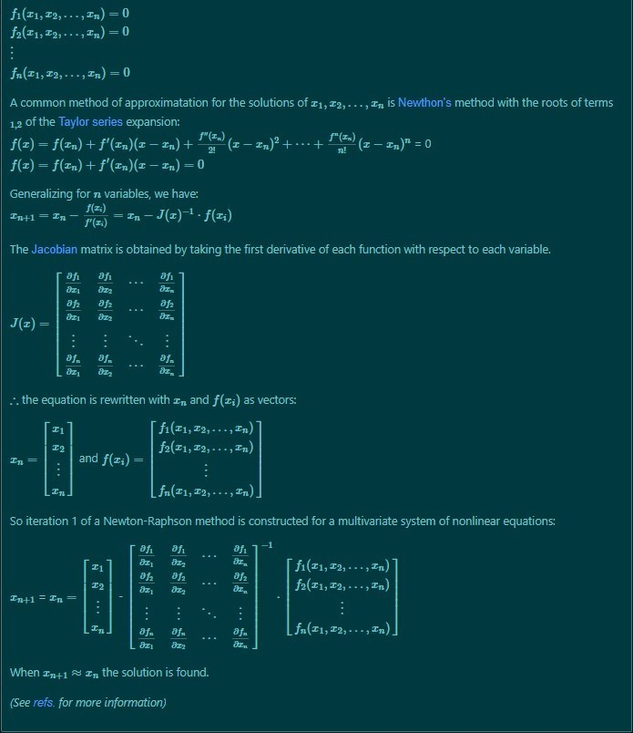
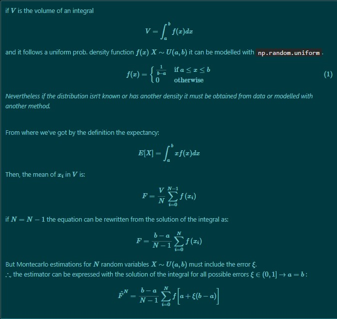

<h1>
 Nonlinear equation params. estimation 
</h1>

  

  

 
 <b>Business Inquiries:</b> 
 

 &nbsp;  &nbsp;  &nbsp;  &nbsp;  &nbsp; 

### Description:
From $n$ non-linear equations with $x_{1},..., x_n$ unknown variables a multivariate system of nonlinear equations with 
dimensional compatibility can be expressed:  

 
 
  

###### <b>LaTeX parsed (Mobile):</b> 

  

<b> The solution is found when the difference is 0 (10 iterations approx.)</b>
  

From [`Scipy: Non-linear solvers`](README.md#References) [`fsolve`](README.md#References) is used to estimate $f(x)$ distribution. 

The dataset <b>Cumulative Distribution</b> is:

$F(X)$ = ${Pr}(a \leq  X \leq b)$:

<i><b>Note:</b> Analytical tests should be performed to validate $f(x)$ & the obtained params $x_i,x_2,...,x_n:$</i>

$$F(X) = \int_{a}^{b} f(x) dx$$ 

$\therefore$ the <b>Expectancy</b> can be expressed as $E[Y]$:

$$E [Y] = \hat{F}^{N} = \int_{a}^{b} x f(x) dx$$ 

And $\hat{F}^{N}$ can be modelled with samplings from $N$ random variables $X \sim U(a,b)$.

<h3><a href="https://en.wikipedia.org/wiki/Beta_distribution">Beta Distribution</a></h3>

+ $X\sim\beta(\alpha, \beta)$ with $f(x_{i}, f_{x_{i}}):$  

|   x   |   f(x)   |   F(x)   |
|-------|---------|---------|
| 40.00 |   inf   | 0.000000|
| 40.01 | 1.040696| 0.019154|
| 40.02 | 0.758528| 0.027915|
| 40.03 | 0.630507| 0.034797|
| 40.04 | 0.553063| 0.040688|
|  ...  |   ...   |   ...   |
| 48.95 | 0.247013| 0.981838|
| 48.96 | 0.265219| 0.984395|
| 48.97 | 0.290729| 0.987167|
| 48.98 | 0.330971| 0.990257|
| 48.99 | 0.413234| 0.993916|

.png)  

 

<h3><a href="https://en.wikipedia.org/wiki/Triangular_distribution">Triangular Distribution</a></h3>

+ $X\sim\text{T}(a,b,c)$:

|   x   |   f(x)   |   F(x)   |
|-------|---------|---------|
|  0    | 40.000000| 0.000000|
|  1    | 40.090909| 0.005102|
|  2    | 40.181818| 0.010203|
|  3    | 40.272727| 0.015305|
|  4    | 40.363636| 0.020406|
|  ...  |   ...   |   ...   |
|  95   | 48.636364| 0.997085|
|  96   | 48.727273| 0.998360|
|  97   | 48.818182| 0.999271|
|  98   | 48.909091| 0.999818|
|  99   | 49.000000| 1.000000|

.png)  

+ Montecarlo Estimation: 

 
 
  

###### <b>LaTeX parsed (Mobile):</b> 

 

if $V$ is the volume of an integral 

$$V = \int_{a}^{b} f(x) dx$$
   
and it follows a uniform prob. density function $f(x)$ $X \sim U(a,b)$ it can be modelled with `np.random.uniform`. 

$f(x) = \frac{1}{b-a}$ if $a \leq x \leq b$  
$0$ otherwise

<i>Nevertheless if the distribution isn't known it must be obtained from data or modelled with another method.</i>

From where we've got by the definition the expectancy: 

$$E[X] = \int_{a}^{b} x f(x) dx$$

Then, the mean of $x_{i}$ in $V$ is:

$$F = \frac{V}{N} \sum_{i=0}^{N-1} f\left(x_i\right)$$

if $N = N-1$ the equation can be rewritten from the solution of the integral as:
$$F = \frac{b-a}{N-1} \sum_{i=0}^N f\left(x_i\right)$$

But Montecarlo estimations for $N$ random variables $X \sim U(a,b)$ must include the error  $\xi$. 
$\therefore$, the estimator can be expressed with the solution of the integral for all possible errors $\xi \in$ $(0,1]$ $\rightarrow$ $a = b$ :

$$\hat{F}^{N} = \frac{b-a}{N-1} \sum_{i=0}^{N} f\bigg[a + \xi(b-a)\bigg]$$

 
 <i>Tools:</i> 
 

##### Actions:   
##### Main Text-Editor:     
##### Language:         
##### Libraries:     
##### Web-Interface:&nbsp;&nbsp; 
##### Version Control:&nbsp;&nbsp; 
  

##### License:&nbsp; 

##### Repository: 

 

    

---
#### References: 

[`Non-Linear Solvers`](https://docs.scipy.org/doc/scipy/reference/optimize.html#id3)

[`Newton Raphson`](https://en.wikipedia.org/wiki/Newton%27s_method) [`Taylor-Series`](https://en.wikipedia.org/wiki/Taylor_series) [`Jacobian`](https://en.wikipedia.org/wiki/Jacobian_matrix_and_determinant)

[`scipy.optimize.fsolve`](https://docs.scipy.org/doc/scipy/reference/generated/scipy.optimize.fsolve.html) 

[`scipy.stats.beta`](https://docs.scipy.org/doc/scipy/reference/generated/scipy.stats.beta.html) $X\sim\beta(\alpha, \beta)$  

[`scipy.stats.gamma`](https://docs.scipy.org/doc/scipy/reference/generated/scipy.stats.gamma.html)
$X\sim\Gamma(\alpha, \beta)$  

[`scipy.stats.triang`](https://docs.scipy.org/doc/scipy/reference/generated/scipy.stats.triang.html)
$X\sim\text{T}(a,b,c)$ 

[`Monte Carlo Estimation`](https://phyusdb.files.wordpress.com/2013/03/monte-carlo-methods-second-revised-and-enlarged-edition.pdf)

